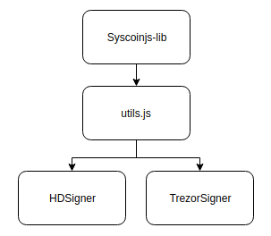

# Overview

This reference documentation is a community effort and is currently still a WIP, as such there will still be some information missing. Please let us know in the [Discord](https://discord.gg/syscoin) if you find mistakes or things that should be added.

The diagram below shows the layout of the syscoinjs-lib module.

- Syscoinjs-lib provides general functions for signing and sending transactions, as well as creating/issuing/sending tokens.
- Utils.js provides utility functions that return information related to user accounts, addresses, tokens as well as many others.
- HDSigner and TrezorSigner are used to sign transactions using software or using a Trezor hardware wallet respectively.

