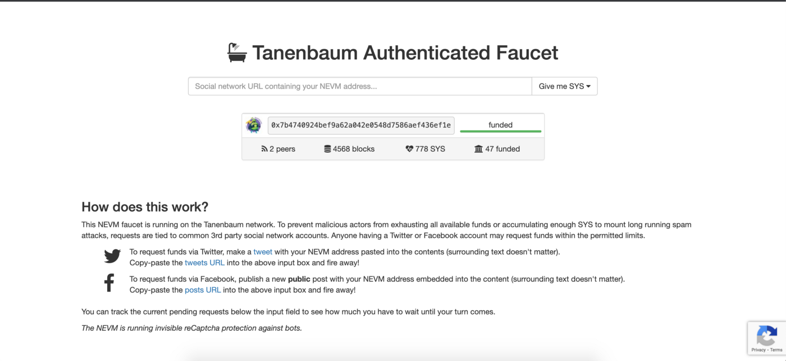
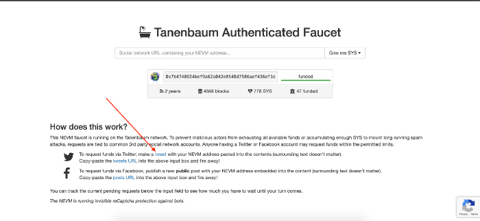
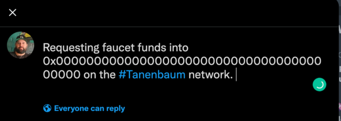

# SYS/TSYS Faucets

After connecting to the Syscoin Mainnet or Tanenbaum Testnet with MetaMask ([tutorial here](../guides/nevm/metamask)), head to either one of the below to get some SYS or tSYS as you require, this guide assumes tSYS but applies to Mainnet (SYS) as well:

- https://faucet.syscoin.org (Mainnet)
- https://faucet.tanenbaum.io (Testnet)

Copy your address from MetaMask.

- Click the the Tweet link on the faucet page.

This will open up Twitter with a Tweet.

- Next, paste in your address replacing the current address then tweet it.

- Once tweeted, click share and copy the tweet link and head back to the faucet page.

- Paste the link into the text box and click Give me SYS. Choose the amount of SYS you would like and wait one block to receive.

Your MetaMask Wallet will now be funded with SYS/tSYS and you can now interact with dApps on Syscoin NEVM.

## Syscoin Testnet Chain

In order to access the Syscoin testnet faucet you must first join the [Syscoin Discord server](https://discord.gg/syscoin).

After doing this, navigate to the #tsys-faucet channel, under the DEVELOPMENT heading.

Then use the command:

`!sendme amount address`

Where the amount is the amount of tSYS you would like to be sent (maximum 100k at a time), and the address is the Syscoin testnet address you would like the funds sent to.
