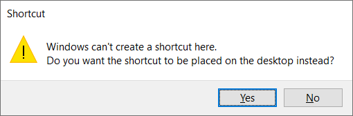

# Testnet Setup


## Syscoin 4.3 Testnet Setup Guide

### Below are the minimum requirements for your VPS. Please do not try to compile without the minimum.

- 64-bit CPU — 2 Cores (4 preferred)

- 4gb RAM (real) minimum (8gb RAM preferred)

- 4gb swap (if less than 8gb real RAM) Will need to use SSD if using Swap

- KVM or OpenVZ (KVM preferred)

- Linux OS — Minimum Ubuntu 18.04, LTS Ubuntu 20.04 LTS (Focal Fossa) preferred.

- 80gb Disk Space (100gb+ SSD preferred).

- Port open for Syscoin (default: 18369) and Geth (default: 30303)

  

### Setup QT for Testnet

You will need to setup a separate datadir for use on Testnet.

Replace 4.2 with 4.3 if necessary

Choose a location for the Testnet data and create a folder, I use

```
D:\Users\john\AppData\Roaming\Syscoin4.3TestNet
```

Open this folder and create a syscoin.conf file with the following and save it as syscoin.conf.

```
#rpc config
testnet=1
[test]
zmqpubnevm=
rpcuser=user
rpcpassword=password
listen=1
daemon=1
server=1
assetindex=1
port=18369
rpcport=18370
rpcallowip=127.0.0.1
gethtestnet=1
addnode=54.203.169.179
addnode=54.190.239.153
```

Close and save this file as syscoin.conf before running QT.

**Now we need to tell QT to use this directory for Testnet**

Use latest RC release and for windows use the win64.zip unzip and run from the download folder. (If you use the installer it will overwrite any existing installation)

https://github.com/syscoin/syscoin/releases

Locate your syscoin-qt.exe, Use 4.3rc x

Right click on it and create a shortcut



You might have to save it to your desktop

Rename the shortcut to something like

```
syscoin-qt.exe — TestNet
```

Right click on the shortcut and choose properties

In the target field add -datadir and the location (created above)after syscoin-qt.exe so it looks like this (note the space before -datadir)

```
“C:\Program Files\Syscoin\syscoin-qt.exe” 
-datadir=D:\Users\john\AppData\Roaming\Syscoin4.3TestNet
```


If you want you can change the icon to distinguish it from Live


Press OK to save changes

Now run QT from this shortcut and it will run QT on Testnet


Once synced you can follow this guide to request tSYS for testing:

[TSYS Faucets](tsys.mdx)

You can also follow the testnet masternode setup guide here:

[Testnet Masternode Setup Guide](testnet_mn.mdx)
