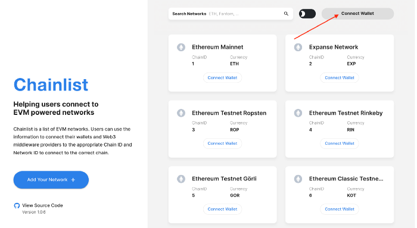

# Add to MetaMask

In this guide, we will show you how to set up Metamask for Syscoin.

## Install the MetaMask Extension from the Store

Visit the [browser extension marketplace](https://chrome.google.com/webstore/detail/nkbihfbeogaeaoehlefnkodbefgpgknn) and download the MetaMask extension.

## Create a MetaMask Wallet or Import One

We would suggest creating a new one if you haven’t done so.

Click import wallet if you have an existing wallet.

Set up your password and secret recovery phrase somewhere safe.

## **Quick Auto Setup** to connect to Syscoin Network

Head to https://chainlist.org/ and click Connect Wallet.

Once Connected, search for Syscoin in the search bar.

Click Add to MetaMask on the relevant network. This should be **Syscoin Mainnet**, unless you would like to test things out on the Syscoin testnet first.

You have now connected to the Syscoin Mainnet with your Metamask Wallet! You can now interact with dApps on Syscoin NEVM.

## Manual Setup to connect to Syscoin Network

Switch the connected blockchain by clicking on the tab saying Main Ethereum Network, we need to add the Syscoin network.

Scroll down until you find Custom RPC.

Enter in the Syscoin NEVM Mainnet or Testnet settings as follows:

### Mainnet

- **Network Name:** Syscoin Mainnet
- **New RPC URL:** [https://rpc.syscoin.org](https://rpc.syscoin.org)
- **Chain ID:** 57
- **Currency Symbol:** SYS
- **Block Explorer URL:** [https://explorer.syscoin.org/](https://explorer.syscoin.org/)

### Testnet

The testnet uses test SYS (tSYS), which has no value and is used for testing code before deploying it on mainnet. There is no need to add this network if you don't want to test anything.

- **Network Name:** Syscoin Tanenbaum Testnet
- **New RPC URL:** [https://rpc.tanenbaum.io](https://rpc.tanenbaum.io/)
- **Chain ID:** 5700
- **Currency Symbol:** tSYS
- **Block Explorer URL:** [https://tanenbaum.io](https://tanenbaum.io/)

Once this information has been entered click **Save**.

You have now connected to the Syscoin Mainnet with your Metamask Wallet! You can now interact with dApps on Syscoin NEVM.

> **Transactions on the Syscoin Mainnet require SYS which will be used as a gas fee.**
>
> **Likewise, transactions on the testnet use tSYS for gas fees.**

Get some tokens from the following faucets to use as gas for transactions:

**Mainnet (SYS)**

- [https://faucet.syscoin.org](https://faucet.syscoin.org)

**Testnet (tSYS)**

- https://ethstats.tanenbaum.io/#faucet
