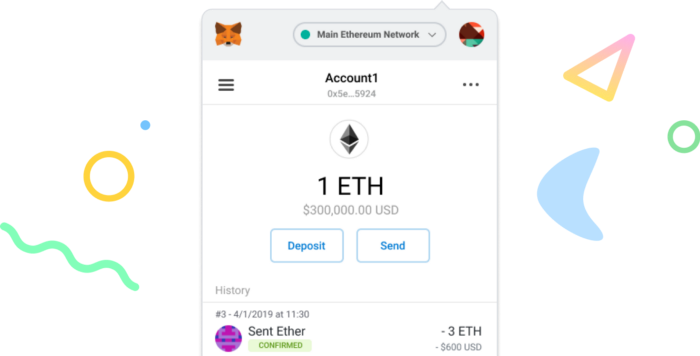
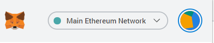
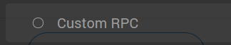

import AddNetworkComponent from '../../../src/components/AddNetworkComponent/AddNetworkComponent';

# Add to MetaMask

You can add the Syscoin Rollux networks to MetaMask using the table below. Welcome to Rollux!

| Network                   |                                                      |
| :------------------------ | ---------------------------------------------------- |
| Rollux OPv1 Testnet       | <AddNetworkComponent network={'Rollux OPv1 Testnet'}/>           |

------

## Install the MetaMask Extension from the Store

Visit the [browser extension marketplace](https://chrome.google.com/webstore/detail/nkbihfbeogaeaoehlefnkodbefgpgknn) and download the MetaMask extension.

## Create a MetaMask Wallet or Import One

We would suggest creating a new one if you haven’t done so.

Click import wallet if you have an existing wallet.

Set up your password and secret recovery phrase somewhere safe.

## Manual Setup to connect to Syscoin Rollux networks

Switch the connected blockchain by clicking on the tab saying Main Ethereum Network.

Scroll down until you find Custom RPC.

Enter the Syscoin Rollux settings as follows:

### Rollux OPv1 Testnet Details

The testnet uses test Rollux SYS (rSYS), which has no value and is used for testing code before deploying it on mainnet. There is no need to add this network if you don't want to test anything.

- **Network Name:** Rollux OPv1 Testnet
- **New RPC URL:** [https://testnet.rollux.com:2814](https://testnet.rollux.com:2814/)
- **Chain ID:** 2814
- **Currency Symbol:** rSYS
- **Block Explorer URL:** [https://explorer.testnet.rollux.com](https://explorer.testnet.rollux.co/)

Once this information has been entered click **Save**.

You have now connected to Rollux OPv1 Testnet with your Metamask Wallet!

> **Transactions on Rollux OPv1 Testnet require Test RSYS which is used for gas.**

### How to get RSYS

Test RSYS can be acquired by bridging TSYS (test SYS) to the Rollux network. Get some TSYS from the following faucet in order to use the bridge:

- https://faucet.tanenbaum.io/

(if you need more TSYS than the faucet provides, please reach-out to your Syscoin contact(s) or ask in Discord)

Now you need to bridge your TSYS to Rollux where it will show up as RSYS at your same address.

To do this, you need to switch to the Syscoin Tanenbaum Testnet network in MetaMask.

> **If you need to add the Syscoin Tanenbaum Testnet to MetaMask, [go here](https://docs.syscoin.org/docs/guides/nevm/metamask/) for instructions**

Simply send TSYS to the following smart contract address on Tanenbaum:
**0x35141FB96fbC6A8F9D5D239b5a6256F056634672**
 
As soon as your transfer receives a confirmation on Tanenbaum, your RSYS will arrive at your same address on the Rollux network.

Now switch your network to Rollux OPv1 Testnet in MetaMask to see your RSYS balance and begin using the network.