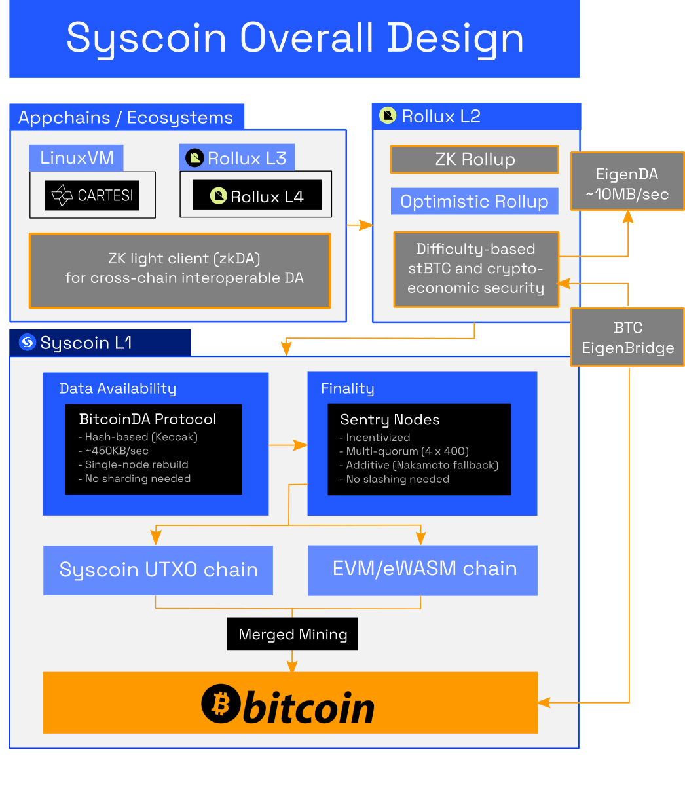

# Syscoin in a Nutshell

## Mission

An open source community dedicated to developing technology that scales every facet of Bitcoin, especially its proof-of-work security, to meet global needs and emerging use-cases, while sticking as close as possible to Bitcoin's original ideals.

Syscoin's evolution across ten years of mainnet and the foresight reflected in its design mean the project has a head-start providing a comprehensive network and protocol for projects aiming to achieve Bitcoin L2. Join our journey!

## The Blockchain Protocol

Syscoin is a mainnet Bitcoin L2 that provides [a data availability protocol that scales](/docs/tech/poda), making EVM and AltVM rollups on Bitcoin a reality. [Merge-mined](/docs/tech/merged-mining) by a majority Bitcoin's hashrate, Syscoin anchors rollups to Bitcoin's own proof-of-work and works with rollups’ existing sequencer architectures. 

One such rollup is [Rollux](https://rollux.com), an EVM-equivalent OPStack with 2 second blocktimes and negligible fees, which is live.

## zkDA and Trustless Interoperability

Syscoin is currently pioneering [zkDA](https://syscoin.org/news/introducing-zkda), an upcoming solution that will make Data Availability cross-chain interoperable through ZK light clients. This will make it easy for other blockchains to tap into Syscoin's DA and ultimately Bitcoin's PoW, and to trustlessly interoperate with other ecosystems that do the same.

## Decentralized Finality without Slashing

Data Availability and scaling it require preventing risks of impact from chain re-orgs. Syscoin solves this with a [finality mechanism of multi-quorum chainlocks](/docs/tech/finality). This creates an additive security layer on top of Bitcoin's PoW. Served by 1,600 randomly selected [Sentry nodes](/docs/tech/sentrynodes), this practically eliminates the risks of re-orgs, 51% attacks and selfish mining, without involving slashing.

## Why $SYS?

Don't blow your finite BTC on gas fees! [$SYS](https://syscoin.org/get-sys) is a utility-focused native coin, based upon EIP-1559. SYS incentivizes Bitcoin miners to keep supporting Bitcoin indefinitely into the future despite diminishing BTC rewards. It also incentivizes Syscoin's Sentry nodes.

