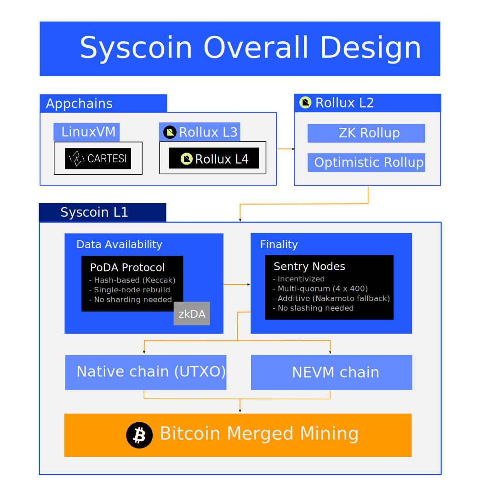

# About Syscoin

## What is Syscoin?

Syscoin is a Bitcoin L2 that is [merge-mined](/docs/tech/merged-mining) with Bitcoin, and a modular Proof-of-Work blockchain solution that provides the enhancements necessary to extend Bitcoin's PoW to scaling layers. Syscoin provides to rollups, and other EVM or AltVM scaling layers, the data availability protocol that is necessary in order for them to tap into Bitcoin's anti-fragility and Proof-of-Work in a scalable way. Syscoin's base is composed of a dual-chain Layer 1: the core is the Syscoin native (UTXO) blockchain providing [data availability](/docs/tech/poda) and [finality](/docs/tech/finality). Running in tandem with the UTXO chain is an Ethereum Virtual Machine (EVM) chain called [*NEVM*](/docs/tech/nevm) (Network-Enhanced Virtual Machine), which is merged mined alongside the UTXO chain and also inherits finality.

Originally brought to mainnet in 2014, the Syscoin protocol has been improved iteratively through creating, optimizing and deprecating features or characteristics across time, settling into the robust and highly useful protocol it is today. 

Quickly see what percentage of Bitcoin's hashrate is supporting Syscoin by checking the following:  
[**Bitcoin hashrate**](https://www.coinwarz.com/mining/bitcoin/hashrate-chart)   
[**Syscoin hashrate**](https://www.coinwarz.com/mining/syscoin/hashrate-chart)

## What Syscoin Provides

- [**PoDA**](/docs/tech/poda) - Proof of Data Availability is an L1 DA protocol for rollups. It is hash-based and built on UTXO. Efficient, general purpose, easy to integrate.
- [**Rollux**](https://rollux.com) - An OPStack rollup anchored to Bitcoin through Syscoin's DA protocol. Provides 2-second blocktime, extremely low fees, and supports application layers on top.  
- [**NEVM**](/docs/tech/nevm) - Network-Enhanced Virtual Machine is the L1 EVM of Syscoin, made specifically for supporting rollups and other scaling layers.
- **Ordinals support** - Our native Bitcoin-based UTXO chain remains closely up-to-date with Bitcoin Core and includes support for Taproot/Schnorr. This means there is a great deal of potential here for cross-chain and even cross-architecture (UTXO <-> EVM Rollup) ordinals. Further, our PoDA protocol means ordinal creators can secure data payloads in a new, more efficient way.
- [**Sentry Nodes and Finality**](/docs/tech/sentrynodes) - Incentivized full nodes collectively provide [finality](/docs/tech/finality) through multi-quorum chainlocks as additive security on top of Bitcoin's PoW. Owners of these collateralized nodes receive rewards, including seniority benefits, for the services they provide to the network.
- [**Z-DAG**](/docs/tech/z-dag) - Based upon Satoshi's "snack machine" concept, Z-DAG is a UTXO-based instant settlement protocol with probabilistic security used to enable a very high throughput of UTXO transfers. Works with UTXO-based assets. In a nutshell, it utilizes Bitcoin's mempool design as a DAG by providing double-spend awareness across a mesh topology.
- [**Notary rulesets**](/docs/tech/notary) - This allows [*Syscoin Platform Token (SPT)*](/docs/tech/tokens) creators to apply their own rulesets on transfers of their SPT and then accept or deny the transfers by signing or not signing the transactions. These off-chain rulesets enable SPT asset managers to maintain compliance even when regulations or business rules change.

## Modular Design

To understand why Syscoin is the perfect choice for developers, one must first understand the new direction in which the EVM-based blockchain ecosystem is evolving. The new paradigm is focused on modular blockchains. Rather than trying to achieve everything (scalability, decentralization, security) on a single blockchain layer, modularity involves multiple layers. There are three terms to keep in mind for the coming blockchain future, these are:

- Execution layer
- Settlement layer
- Data availability

These will be expanded on below.

### Execution Layer

The execution layer in the new blockchain paradigm is where all the day-to-day transactions take place. Using a DEX to swap tokens? Buying NFTs on a marketplace? Whatever you can think of, most of these smart contracts will be operating on the execution layer. These Layer 2 scaling solutions can be optimistic or ZK-based rollups, or perhaps hybridized rollups in the future. Layer 1 blockchains, i.e. Syscoin NEVM or Ethereum, cannot scale on their own without trading-off some security and/or decentralization. This is why execution belongs a separate Layer 2 focused on scalability, enabling the Layer 1 to serve its best purposes - secure decentralized settlement and data availability.

### Settlement Layer

The settlement layer is the layer that secures the ecosystem, as such it should be highly secure such as through being [merge-mined](/docs/tech/merged-mining) with Bitcoin. Highly scalable rollups operating as the execution layer for Syscoin will, at regular intervals, post proofs of the transactions that took place on them to the [NEVM](/docs/tech/nevm) blockchain in order to securely and immutably store what has taken place within the rollups.

### Data Availability

The PoDA protocol serves data-availability within the security domain of Layer 1 enabling rollups to properly serve critical financial applications, and secure users’ ability to exit back to L1. Syscoin was the first project to deliver a dedicated Layer 1 DA protocol to mainnet, with PoDA in March 2023. PoDA is an alternative to sharding focused DA, and intersects Bitcoin through its use of Syscoin's merged mining, UTXO model, and simple fee market.

## Why Choose Syscoin?

Security: Syscoin provides manifold security as a settlement and data availability layer for rollups and other scaling solutions. First, leveraging merge-mining with Bitcoin, Syscoin is currently powered by around 60% of Bitcoin's own hashrate. This taps you into the world's best Proof-of-Work network for proven antifragility and fault tolerance as well as resilience against economic black swans, at a level which pure Proof-of-stake systems simply cannot match. Additionally, Syscoin's Sentry nodes provide multi-quorum chainlocks for an additive layer of finality which keeps intact the benefits of Proof-of-work while greatly mitigating the risks of 51% attacks and selfish mining. Furthermore, the security of Syscoin's data availability will soon extend to nearly any blockchain ecosystem through zkDA, a new Syscoin innovation in-progress that also brings a new level of cross-chain interoperability. All of this underscores Syscoin's commitment to robust security.

Scalability: With a unique and holistically modular design, Syscoin stands out with exceptional support for scalability layers. Providing a live dedicated data availability protocol on Layer 1 means Syscoin is already ideal for natively supporting rollups of all kinds as scaling layers. Rollux, the first rollup built on Syscoin, is a perfect example.  Scalability, in this context, extends beyond transaction volume and speed of settlement; it also encompasses the affordability of transactions. Low cost execution makes Syscoin an attractive option for projects seeking a settlement layer for their rollup, especially those aiming to make frequent state commitments. In comparison to other EVM-based chains, Syscoin is more scalable and cost-effective, but that's not all.

Decentralization: The network boasts approximately 2,700 independently owned and operated Sentry nodes which work together deterministically to serve a decentralized finality mechanism. The rewards associated with hosting a Sentry node contribute to their growth and retention, including seniority benefits. Over 75% of these nodes have been active and collateralized for over two and half years. Furthermore, SYS, the native currency of Syscoin, has been in circulation since 2014 and is broadly distributed.

In summary, Syscoin is

- modular
- exceptionally secure
- scalable
- decentralized
- flexible
- economical
- reliable

Projects that are considering Syscoin, or that have questions, can reach out to the community and teams.

- Contact us here: https://syscoin.org/contact
- Or you can connect with us on the Syscoin Discord server: https://discord.gg/syscoin
