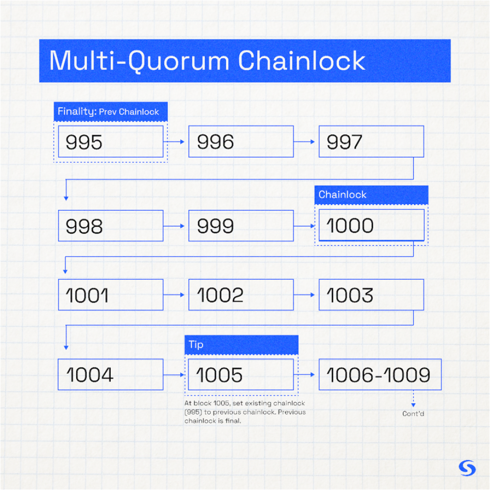

# Finality  
Decentralized and Fault Tolerant

Finality is the affirmation that all well-formed blocks will not be revoked once committed to the blockchain. The chain is not subject to the risk of reorganization further back than the most recent block that achieved finality. On the Syscoin network, all nodes recognize finalized blocks as valid and accepted. Any nodes with chains that differ further back than the last chainlock are not accepted as valid peers on the network.

Syscoin’s finality uses chainlocks which are sourced from a multi-quorum consisting of 4 groups of 400 [Sentry Nodes](/docs/tech/sentrynodes) (1,600 total). These quorums are randomly selected among the entirety of Syscoin's network of Sentry Nodes (currently ~2,700 at time of documenting). Each quorum is reformed every few hours. 3 out of 4 quorums must agree on a block in order to establish a chainlock.   

This mechanism provides a high probability of finality in a decentralized way, and fault tolerance is inherited from the underlying Nakamoto consensus.

|             |Time to finality after block|Blocktime   |Resilience absent finality        |Mechanism     |
| :-----------|----------------------------|------------|----------------------------------|--------------|
|**Syscoin**  |~12.5 minutes (every 5 blocks) |2.5 minutes |Nakamoto longest chain rule       |PoW + Quorums |
|**Ethereum** |~14 minutes (~3 epochs)     |10 seconds  |None. No finality = breaking event|PoS + Casper  |

### Graceful degredation

In the rare event that finality cannot be achieved on a block for any reason
1.  The network falls back to the longest chain rule which is a seamless and non-breaking event, unlike pure proof-of-stake systems, all of which break under the same scenario.
1.  Because [data availability (PoDA)](/docs/tech/poda) depends upon finality for safe pruning of the blob cache, PoDA will retain blobs indefinitely until the blob's on-chain proof is secured by finality across a sum of ~six hours.

### Resistance

This finality mechanism provides resistance to 51% and selfish mining attacks. Attackers must accomplish two expensive and challenging tasks to achieve a successful 51% attack: 1) Control greater than 50% of Bitcoin's hash power supplied to Syscoin, plus 2) Control a super-majority of Syscoin Sentry Nodes.

**Chainlocks can be viewed from a fully synced node by using Syscoin Core RPC `getchainlocks`.**

