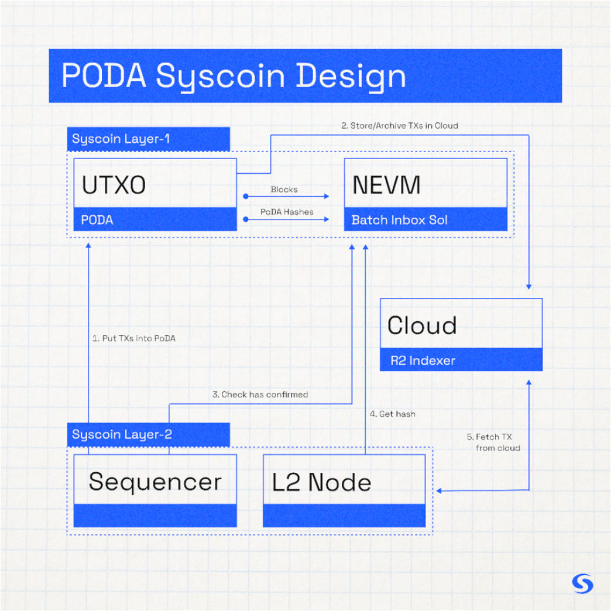

#BitcoinDA (Data Availability on Layer 1)    

## Overview

Data availability is required to exist within the security domain of Layer 1 in order for rollups to properly serve critical financial applications by securing users’ ability to exit to L1. Syscoin’s L1 DA solution is called BitcoinDA. BitcoinDA differs from Ethereum’s Proto-Danksharding, and Celestia, in how data is stored, presented, pruned, and how fees are calculated. BitcoinDA provides characteristics that make it a valuable alternative to Ethereum’s work-in-progress data availability solution, Proto-Danksharding.

BitcoinDA’s advantages can be summarized as:

- Cheaper transactions
- No data sharding required
- Greater data throughput with efficient Keccak data blobs
- Secured by Bitcoin’s own PoW plus Syscoin's finality
- More resilient to network-based outages/censorship
- Simpler data fee market based on Syscoin’s UTXO fee market
- Nakamoto Assumption: Only one honest node is needed to guarantee data

**BitcoinDA's design is based on Syscoin's original PoDA (proof of data availability), which is a separation of concerns between data availability and data archiving with the protocol's purpose being the former.**

:::info
**Purpose of BitcoinDA**  
   
- **Deterministically ensure and prove that data has been placed within the commons and that the public was given a sufficient and defined opportunity to archive it.**
- **Provide an on-chain hash necessary to verify the integrity of any archived data at a later time, and the option of custom hashes for other purposes a user might implement on top.**
:::

With BitcoinDA, by default, a Keccak256 hash of the full data blob is stored on Layer 1, while an assumption is made that at least one honest party in the world will archive the blob within at least a six-hour window of time - similar to the honesty assumption made when syncing a Bitcoin node (at least one honest node). After this window of time, the blob is pruned from the network's cache while its hash remains on-chain.

Validium (fully offchain DA) is also available as an alternative to BitcoinDA for less-critical applications where the focus might be on even lower cost and higher throughput by trading-off Layer 1 data security. However, in the case of Syscoin PoDA, Layer 1 data security is quite affordable; archivers store full data off-chain while you gain the security of an on-chain hash.



## Sample BitcoinDA transaction

This transaction was submitted by Rollux L2 to the Syscoin Native (UTXO) Mainnet.    
**https://blockbook.syscoin.org/tx/8de8bf84a1c55a06ad2d10ee10e036e51d122d02ded0a57ebddfd1da640aebc6**  

Note: The version hash is visible in the raw transaction data as scriptPubKey.asm: “OP_RETURN 20**e76700ef2ceab4e1f71af30a1fcf0662eedbb932aa66285ac30dbca46256e7d4**”

The hash of the data blob is stored on-chain as seen above in boldened portion of the sample's OP_RETURN. This should be used to prove the integrity of archived data at any future time.

## How to interact with BitcoinDA

**Syscoin Core (>=v4.4) provides an RPC interface that enables use of the BitcoinDA protocol**

Once submitted, the transaction with version hash is stored onchain in the next available block, while the full data blob is made publicly available within the native chain’s cache for a period of six hours of finality before being pruned.  As long as the blob is cached, archiving services can access and store it.  In the event that sufficient finality is absent, BitcoinDA will retain blobs in the cache until aforementioned finality threshold is met.  This helps ensure published data is given proper guarantees to solve fisherman's dilemma even during adverse network conditions. 

  
### `syscoincreatenevmblob`

Submit data blob with auto-generated Keccak256 versionHash (recommended)

```text
syscoincreatenevmblob "data" ( overwrite_existing conf_target "estimate_mode" fee_rate )

Arguments:
1. data                  (string, required) blob in hex
2. overwrite_existing    (boolean, optional, default=true) true to overwrite an existing blob if it exists, false to return versionhash of data on duplicate.
3. conf_target           (numeric, optional, default=wallet -txconfirmtarget) Confirmation target in blocks
4. estimate_mode         (string, optional, default="unset") The fee estimate mode, must be one of (case insensitive):
                         "unset"
                         "economical"
                         "conservative"
5. fee_rate              (numeric or string, optional, default=not set, fall back to wallet fee estimation) Specify a fee rate in sat/vB.

Examples:
> syscoin-cli syscoincreatenevmblob "data"
> curl --user myusername --data-binary '{"jsonrpc": "1.0", "id": "curltest", "method": "syscoincreatenevmblob", "params": ["data"]}' -H 'content-type: text/plain;' http://127.0.0.1:8370/
```

:::tip
You can extend the TTL (time-to-live) of a BitcoinDA blob for another six hours by resubmitting the same exact blob with the `overwrite_existing` flag set to TRUE.
:::

  
### `syscoincreaterawnevmblob`

Submit data blob with custom (user-specified) versionHash. This might be useful if you wish to use a different hash algorithm or implement some custom commitment scheme as a layer on top of BitcoinDA. Otherwise, it is best to stick with the `syscoincreatenevmblob` standard.

```text
syscoincreaterawnevmblob "versionhash" "data" ( conf_target "estimate_mode" fee_rate )

Arguments:
1. versionhash      (string, required) Version hash of the blob
2. data             (string, required) data in hex
3. conf_target      (numeric, optional, default=wallet -txconfirmtarget) Confirmation target in blocks
4. estimate_mode    (string, optional, default="unset") The fee estimate mode, must be one of (case insensitive):
                    "unset"
                    "economical"
                    "conservative"
5. fee_rate         (numeric or string, optional, default=not set, fall back to wallet fee estimation) Specify a fee rate in sat/vB.

Examples:
> syscoin-cli syscoincreaterawnevmblob "versionhash" "data" 6 economical 25
> curl --user myusername --data-binary '{"jsonrpc": "1.0", "id": "curltest", "method": "syscoincreaterawnevmblob", "params": ["versionhash" "data" 6 economical 25]}' -H 'content-type: text/plain;' http://127.0.0.1:8370/
```

### `listnevmblobdata`

Retrieve a list of blobs from the UTXO cache.

```text
listnevmblobdata ( count from {"getdata":bool} )

Arguments:
1. count                   (numeric, optional, default=10) The number of results to return.
2. from                    (numeric, optional, default=0) The number of results to skip.
3. options                 (json object, optional) A json object with options to filter results.
     {
       "getdata": bool,    (boolean, optional) Return data from blob
     }

Result:
[                             (json array)
  {                           (json object)
    "versionhash" : "hex",    (string) The version hash of the NEVM blob
    "datasize" : n,           (numeric) Size of data blob in bytes
    "data" : "hex"            (string) Blob data if getdata is true
  },
  ...
]

Examples:
> syscoin-cli listnevmblobdata 0
> syscoin-cli listnevmblobdata 10 10
> syscoin-cli listnevmblobdata 0 0 '{"getdata":true}'
> curl --user myusername --data-binary '{"jsonrpc": "1.0", "id": "curltest", "method": "listnevmblobdata", "params": [0, 0, '{"getdata":false}']}' -H 'content-type: text/plain;' http://127.0.0.1:8370/
```

### `getnevmblobdata`

Retrieve a specific blob from the cache by version hash or transaction id

```text
getnevmblobdata "versionhash_or_txid" ( getdata )

Arguments:
1. versionhash_or_txid    (string, required) The version hash or txid of the NEVM blob
2. getdata                (boolean, optional) Optional, retrieve the blob data

Examples:
> syscoin-cli getnevmblobdata 
> curl --user myusername --data-binary '{"jsonrpc": "1.0", "id": "curltest", "method": "getnevmblobdata", "params": []}' -H 'content-type: text/plain;' http://127.0.0.1:8370/
```

## How to run a BitcoinDA archive service

As mentioned previously, with BitcoinDA the focus is DA. Archiving is left non-determined. However, tools are available.

Syscoin's Sentinel implementation provides the means to both store and retrieve BitcoinDA data blobs. Archivers may also employ other means at their discretion. If decentralized archiving is a priority, there are networks that can be custom-integrated with BitcoinDA, such a KYVE.

Syscoin **[Sentinel](https://github.com/syscoin/sentinel)** includes a BitcoinDA archive client/server with out-of-the-box support for Filecoin/Lighthouse and Cloudflare R2 (supply your API keys)   
This is relatively easy to set up. Refer to the **[instructions](https://github.com/syscoin/sentinel#poda)** on GitHub.


